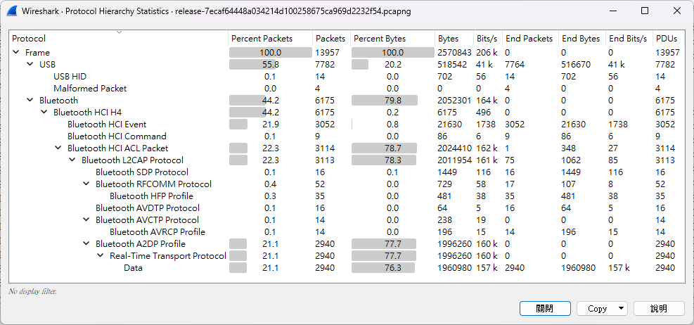
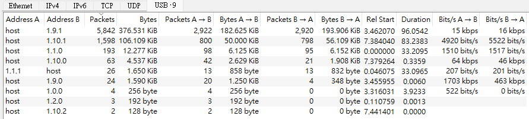
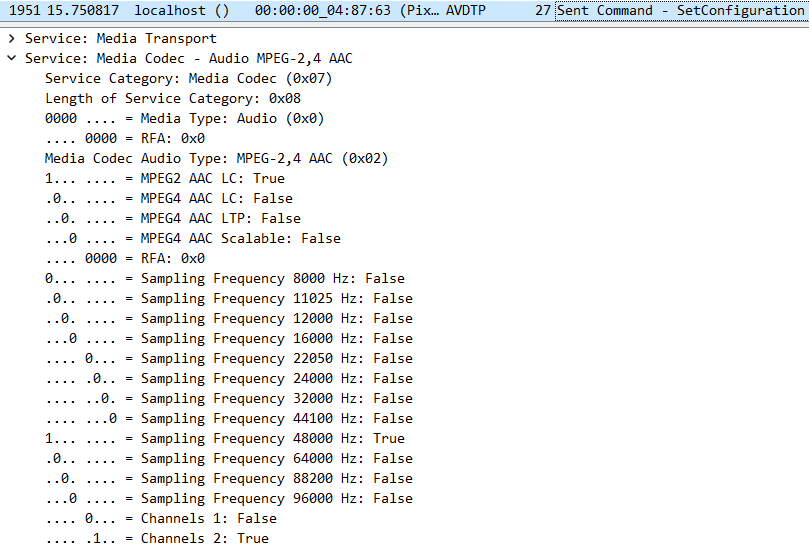
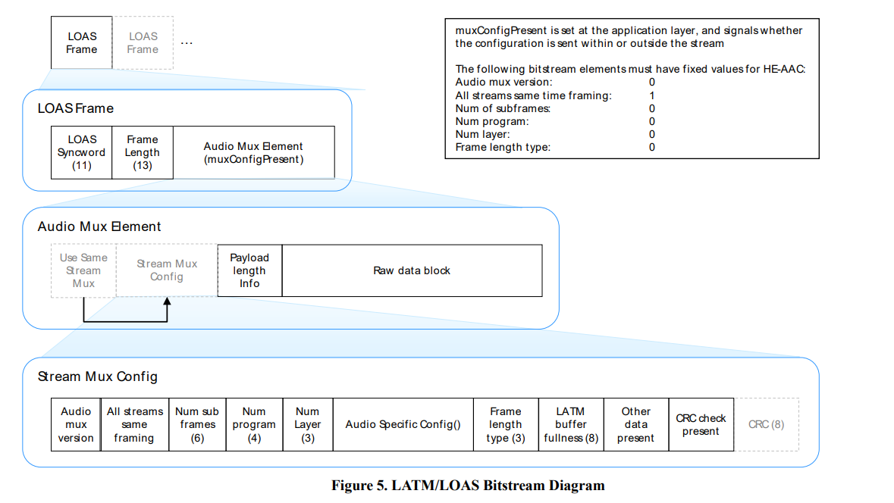

# Not Just usbpcap
- Tags: `forensics`
- Score: 277/500
- Solves: 22

## Description
I recorded one's USB traffic on his computer, can you find the hidden secret?  
[release.pcapng](release/release-7ecaf64448a034214d100258675ca969d2232f54.pcapng)

## Overview
Topics: `usbhid`, `bluetooth audio`

The pcap file contains the traffic captured on three interfaces (bluetooth0, usbmon0, usbmon1).

Flag format is in keyboard USB traffic.
Flag content is in bluetooth A2DP traffic.

## Solution


In first glance, you can noticed that there are several USB and bluetooth traffic.  

### USB HID

Take a look at USB conversations, one can notice that most of the traffic is related to device `9` and `10`. In addition, there is `USB HID` protocol in the protocol hierarchy statistics, so these two device may be HID device.

We can use `usb.transfer_type == 2 && usb.bDescriptorType == 4 && usb.bInterfaceClass == 3` filter to find their according CONFIGURATION DESCRIPTOR, and check `bInterfaceProtocol` in their INTERFACE DESCRIPTOR to determine its device type (1,for keyboard, 2 for mouse).  
For those interested, you can check [Device Class Definition for HID 1.11](https://www.usb.org/document-library/device-class-definition-hid-111) - 4.3 Protocol.

By extracting the keyboard key presses ([parse_keyboard.py](solution/parse_keyboard.py))<sup>1</sup>, one can get the following content:
```
radio.chal.hitconctf.com


Sorry, no flag here. Try harder.
But i can tell you that the flag format is hitcon{lower-case-english-separated-with-dash}
Again, this is not the flag :(

C8763!
```

The flag format can be retrieved now.  
In addition, `radio.chal.hitconctf.com` also served as hint that one should take a look at audio packets. It is also a viewable site (backup: http://hitcon-radio.pages.dev).

### Bluetooth Audio

Before starting dumping audio, one should first identify which codec has been used.  
With AVDTP configuration, one can see that the codec is `MPEG-2 AAC LC` with 48000 Hz, stereo.  

The audio stream is put in a RTP stream, one can check [RFC6416 RTP Payload Format for MPEG-4 Audio/Visual Streams](https://datatracker.ietf.org/doc/html/rfc6416) - 6.1 RTP Packet Format for the detail.  
Each RTP packet's structure looks like the following:
```
 0                   1                   2                   3
 0 1 2 3 4 5 6 7 8 9 0 1 2 3 4 5 6 7 8 9 0 1 2 3 4 5 6 7 8 9 0 1
+-+-+-+-+-+-+-+-+-+-+-+-+-+-+-+-+-+-+-+-+-+-+-+-+-+-+-+-+-+-+-+-+
|V=2|P|X|  CC   |M|     PT      |       sequence number         |RTP
+-+-+-+-+-+-+-+-+-+-+-+-+-+-+-+-+-+-+-+-+-+-+-+-+-+-+-+-+-+-+-+-+
|                           timestamp                           |Header
+-+-+-+-+-+-+-+-+-+-+-+-+-+-+-+-+-+-+-+-+-+-+-+-+-+-+-+-+-+-+-+-+
|           synchronization source (SSRC) identifier            |
+=+=+=+=+=+=+=+=+=+=+=+=+=+=+=+=+=+=+=+=+=+=+=+=+=+=+=+=+=+=+=+=+
|            contributing source (CSRC) identifiers             |
|                             ....                              |
+=+=+=+=+=+=+=+=+=+=+=+=+=+=+=+=+=+=+=+=+=+=+=+=+=+=+=+=+=+=+=+=+
|                                                               |RTP
:                 audioMuxElement (byte aligned)                :Payload
|                                                               |
|                               +-+-+-+-+-+-+-+-+-+-+-+-+-+-+-+-+
|                               :...OPTIONAL RTP padding        |
+-+-+-+-+-+-+-+-+-+-+-+-+-+-+-+-+-+-+-+-+-+-+-+-+-+-+-+-+-+-+-+-+
```

In RFC6416, it also mentioned that `MPEG-4 Audio streams MUST be formatted LATM (Low-overhead MPEG-4 Audio Transport Multiplex) streams`, which is defined in ISO/IEC 14496-3.  

The decoding for LATM is a little bit complex in the ISO document.  
For the simplicity, the diagram in [MPEG-4: Audio - White paper on AAC Transport Formats](https://www.mpeg.org/standards/MPEG-4/3/) is more clear about LATM structure.


My ffmpeg cannot decode LATM streams directly. By checking [ffmpeg source code](https://github.com/FFmpeg/FFmpeg/blob/67cc7aaa51fcd781ac5920d3c739e28c81cbb0cb/libavcodec/aacdec.c#L481-L501), ffmpeg does support LATM, but it requires LOAS header.  
Therefore, to decode the LATM stream, we can simply prepend LOAS header to each AudioMuxElement, which make it readable with ffmpeg libavcodec.  

Dump packets with filter `rtp` (or a2dp) via `Wireshark -> Export specified packets`, then run [loas.py](solution/loas.py) to generate LOAS stream.

The LOAS stream can be converted with `ffmpeg -i radio.loas radio.wav` or directly played with VLC.

The audio has the following content:

```
Welcome back to "Secret Flags Unveiled" on HITCON Radio! I'm John, your host for this intriguing journey into the world of secret flags.

Today, we'll explore the secret flag, where flag served as vital information for scoring in CTFs.

The secret flags are crucial to the success of HITCON CTF, and one of them is going to be revealed. Listen carefully, you get only one chance.

Flag start.
secret flags unveiled with bluetooth radio.
Flag end.

Just simply wrap the text you heard with the flag format. If you find some information missing, just dig deeper in the packet.

Stay tuned for more secret flags. This is John, signing off from "Secret Flags Unveiled" on HITCON Radio. Keep those flags flying high!
```

By the way, ffmpeg also recognizes AAC packed in ADTS stream, so one can substitute LATM header with corresponding ADTS header. See this [stackoverflow post](https://stackoverflow.com/questions/35915317/decode-mpeg-2-4-aac-lc-latm-bitstream-for-a2dp), which may be found when searching for `\x47\xfc\x00\x00` (first bytes for StreamMuxConfig) or `decode MPEG 2,4 AAC LC LATM`. Although the audio would be noisy with this method.  

## Flag
<details>
<summary>Spoiler</summary>

`hitcon{secret-flags-unveild-with-bluetooth-radio}`
</details>

---
<sup>1</sup> *I also have an old [writeup](https://hackmd.io/@t510599/acsc-2023-quals-pcap) for pcap chals in ACSC 2023 quals, which processes both keyboard and mouse HID. The script is fixed version.*