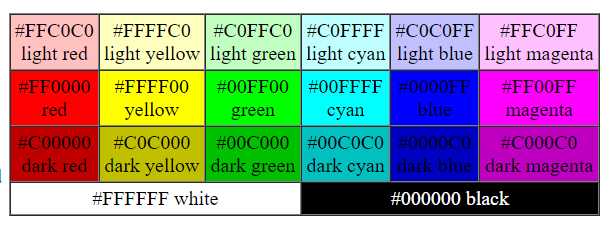

# MyVerilogFinalProject
- Tags: `Misc` `CSC`

> I am working on my logic design lab final project, and I try to show the flag by VGA with my Nexys 3™ FPGA Board.  
> To make the image available for burning to block memory with Vivado, we have to convert it first.  
> Here is my converted image, can you find the flag?  

- Hint 1: It is something that could be executed without Vivado.  
- Hint 2: The term **execute** in previous hint means that the image is a program that is runnable.  

## Design
First, the flag is compiled to `.piet` code by [scripts/text2piet.py](scripts/text2piet.py), then use `piet-assembler` from [sl236/Piet](https://github.com/sl236/Piet) to assemble it into a PIET program image.  
After drawing the fake flag text on it (which has nothing to do with the program), the image is converted into `.coe` file with [Jesse-Millwood/image-2-coe](https://github.com/Jesse-Millwood/image-2-coe).  

## Solution
First, write a simple script to convert the coe file back to the image.  
When you get the image, you might find out that it looks like a PIET program. (By experience, or some luck)  

Since LSB has been dropped during the conversion, the image recovered from coe file could only represent less colors.  
For PIET, it makes use of 20 colors as its instruction, but only 16 colors could be represented.  

| COLOR NAME    | HEX     | Same as |
| ------------- | ------- | ------- |
| LIGHT RED     | #FFC0C0 | LIGHT MAGENTA | 
| LIGHT YELLOW  | #FFFFC0 | WHITE |
| LIGHT GREEN   | #C0FFC0 | LIGHT CYAN |
| LIGHT CYAN    | #C0FFFF | LIGHT GREEN |
| LIGHT BLUE    | #C0C0FF | |
| LIGHT MAGENTA | #FFC0FF | LIGHT RED |
|       RED     | #FF0000 | |
|       YELLOW  | #FFFF00 | |
|       GREEN   | #00FF00 | |
|       CYAN    | #00FFFF | |
|       BLUE    | #0000FF | DARK BLUE |
|       MAGENTA | #FF00FF | |
| DARK  RED     | #C00000 | |
| DARK  YELLOW  | #C0C000 | |
| DARK  GREEN   | #00C000 | |
| DARK  CYAN    | #00C0C0 | |
| DARK  BLUE    | #0000C0 | BLUE |
| DARK  MAGENTA | #C000C0 | |
| WHITE         | #FFFFFF | LIGHT YELLOW |
| BLACK         | #000000 | |

| Before | After |
| ------ | ----- |
|  |  |

(Color table from https://www.dangermouse.net/esoteric/piet.html)

Now, we can write a script ([scripts/coe2piet.py](scripts/coe2piet.py)) to convert it into a PIET program, but still not the original one.  

If you get familiar with how PIET works, you can figure out how my flag program works then recover the duplicated colors.  

Or if you are lazy to study with PIET instructions, since the duplicated color have only 2 possible original color, you can simply change those duplicated colors, and try until you find the correct one.  

Flag: `TSJ{vivado_iS_avocado}`